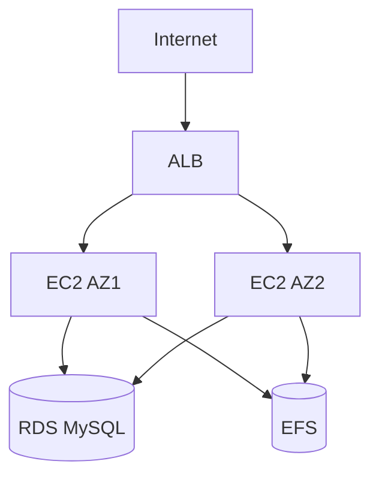

# CloudPress: Implantação de WordPress na AWS

Infraestrutura automatizada para deploy de WordPress na AWS utilizando os seguintes serviços:

- **Componentes Principais:**
  - **AWS EC2**: Instâncias para hospedagem dos containers
  - **AWS RDS**: Banco de dados MySQL gerenciado
  - **AWS EFS**: Armazenamento persistente compartilhado
  - **Docker Compose**: Orquestração de containers

**Arquitetura Básica:**
1. VPC com sub-redes públicas/privadas
2. Grupo de Segurança para cada camada (EC2, RDS, EFS)
3. Cluster RDS MySQL em multi-AZ
4. Sistema de arquivos EFS montado nas instâncias EC2
5. Load Balancer para distribuição de tráfego

## 1. Configuração da Rede AWS

### 1.1. Criar VPC
1. Acesse **AWS Console → VPC → Your VPCs → Create VPC**
2. Configure:
   - **Name tag:** `WordPress-VPC`
   - **IPv4 CIDR:** `10.0.0.0/16`

### 1.3. Configurar Internet Gateway
1. Crie um Internet Gateway (`WordPress-IGW`)
2. Anexe à VPC

### 1.4. Configurar NAT Gateway
1. Aloque um Elastic IP
2. Crie NAT Gateway na subnet pública AZ1
3. Crie tabela de rotas para subnets privadas apontando tráfego para o NAT

---

## 2. Grupos de Segurança

### 2.1. Load Balancer (LB-SG)
- **Entrada:** HTTP (80) de 0.0.0.0/0
- **Saída:** All traffic

### 2.2. EC2 (EC2-SG)
- **Entrada:**
  - HTTP (80) do LB-SG
  - SSH (22) do seu IP
- **Saída:** All traffic

### 2.3. RDS (RDS-SG)
- **Entrada:** MySQL (3306) do EC2-SG

### 2.4. EFS (EFS-SG)
- **Entrada:** NFS (2049) do EC2-SG

---

## 3. Banco de Dados RDS MySQL

1. **Criação do Banco:**
   - **Engine:** MySQL
   - **Instance class:** db.t3.micro
   - **Storage:** 20 GiB (GP2)
   - **Credentials:** 
     - Usuário: `admin`
     - Senha: `DB_P@ssw0rd!`
   - **Network:** 
     - VPC: `WordPress-VPC`
     - Subnets: Private-Subnet-AZ1 e AZ2
     - Security Group: RDS-SG

2. **Criar Database Manualmente:**
```sql
CREATE DATABASE wordpress;
```

---

## 4. Sistema de Arquivos EFS

1. **Criar File System:**
   - Name: `wordpress-efs`
   - VPC: `WordPress-VPC`
   - Mount Targets: Associar às subnets privadas

2. **Obter Endpoint DNS:**
   - Exemplo: `fs-01234567.efs.us-east-1.amazonaws.com`

---

## 5. Configuração das Instâncias EC2

### 5.1. Lançar Instâncias
- **AMI:** Amazon Linux 2
- **Tipo:** t3.micro
- **Network:** 
  - Subnets privadas (AZ1 e AZ2)
  - Security Group: EC2-SG

### 5.2. Script de Inicialização (User Data)
```bash
#!/bin/bash
# Atualizar sistema
sudo yum update -y

# Instalar Docker
sudo yum install -y docker
sudo systemctl start docker
sudo systemctl enable docker

# Instalar EFS Utilities
sudo yum install -y amazon-efs-utils

# Montar EFS
sudo mkdir -p /mnt/efs/wordpress
sudo mount -t efs fs-01234567:/ /mnt/efs/wordpress
echo "fs-01234567:/ /mnt/efs/wordpress efs defaults,_netdev 0 0" | sudo tee -a /etc/fstab

# Configurar Docker Compose
sudo curl -L "https://github.com/docker/compose/releases/download/v2.20.0/docker-compose-$(uname -s)-$(uname -m)" -o /usr/local/bin/docker-compose
sudo chmod +x /usr/local/bin/docker-compose

# Criar docker-compose.yml
cat <<EOF > /home/ec2-user/docker-compose.yml
version: '3.8'

services:
  wordpress:
    image: wordpress:6.2
    restart: always
    ports:
      - "80:80"
    environment:
      WORDPRESS_DB_HOST: wordpress-db.123456.us-east-1.rds.amazonaws.com
      WORDPRESS_DB_USER: admin
      WORDPRESS_DB_PASSWORD: DB_P@ssw0rd!
      WORDPRESS_DB_NAME: wordpress
    volumes:
      - /mnt/efs/wordpress:/var/www/html/wp-content
EOF

# Iniciar containers
sudo docker-compose -f /home/ec2-user/docker-compose.yml up -d
```

---

## 6. Application Load Balancer

### 6.1. Criar ALB
- **Name:** `WordPress-ALB`
- **Scheme:** Internet-facing
- **Subnets:** Public-Subnet-AZ1 e AZ2
- **Security Group:** LB-SG

### 6.2. Configurar Target Group
- **Protocol:** HTTP:80
- **Health Check Path:** `/wp-admin/install.php`
- **Register Targets:** Instâncias EC2

---

## 7. Validação Final

### 7.1. Testar Acesso ao WordPress
- Acesse o DNS do ALB via navegador:
  ```
  http://wordpress-alb-1234567890.us-east-1.elb.amazonaws.com
  ```

### 7.2. Verificar EFS
```bash
ssh -i key.pem ec2-user@EC2_IP
ls /mnt/efs/wordpress
# Deve listar diretórios do WordPress
```

### 7.3. Monitorar Containers
```bash
sudo docker ps
# Deve mostrar container WordPress rodando
```

---

## Diagrama da Arquitetura


---

## Considerações Importantes

1. **Persistência de Dados:**
   - Todo conteúdo do WordPress é armazenado no EFS via volume `/wp-content`
   - Banco de dados gerenciavel via RDS

2. **Escalabilidade:**
   - Auto Scaling Group pode ser adicionado posteriormente
   - EFS permite compartilhamento entre múltiplas instâncias

3. **Segurança:**
   - Instâncias em subnets privadas
   - Acesso SSH restrito por IP
   - Comunicação interna via security groups

4. **Custos:**
   - Utilizar recursos Free Tier quando possível
   - Monitorar uso do RDS e EFS

5. **Backup:**
   - Habilitar snapshots automáticos no RDS
   - Backup periódico do EFS via AWS Backup
